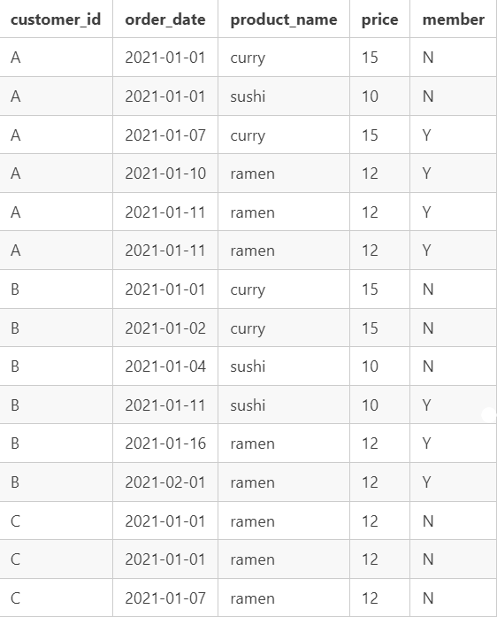
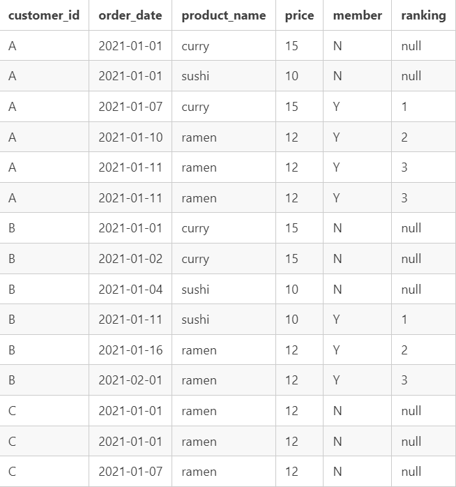

# Case Study Questions and Answers

## 1. What is the total amount each customer spent at the restaurant?

* Customer A: $76
* Customer B: $74
* Customer C: $36

## 2. How many days has each customer visited the restaurant?

* Customer A: 4 days
* Customer B: 6 days
* Customer C: 2 days

## 3. What was the first item from the menu purchased by each customer?

* Customer A: sushi
* Customer B: curry
* Customer C: ramen

## 4. What is the most purchased item on the menu and how many times was it purchased by all customers?

* Ramen
* Purchased 8 times total

## 5. Which item was the most popular for each customer?

* Customer A: ramen
* Customer B: curry, sushi, and ramen
* Customer C: ramen

## 6. Which item was purchased first by the customer after they became a member?

* Customer A: curry
* Customer B: sushi

## 7. Which item was purchased just before the customer became a member?

* Customer A: curry and sushi
* Customer B: sushi

## 8. What is the total items and amount spent for each member before they became a member?

* Customer A: Total 3 items and $40 amount
* Customer B: Total 2 items and $25 amount

## 9.  If each $1 spent equates to 10 points and sushi has a 2x points multiplier - how many points would each customer have?

* Customer A: 860 points
* Customer B: 940 points
* Customer C: 360 points

## 10. In the first week after a customer joins the program (including their join date) they earn 2x points on all items, not just sushi - how many points do customer A and B have at the end of January?

* Customer A: 1370 points
* Customer B: 1020 points

 
 
 

# Bonus Questions

The following questions are related creating basic data tables that Danny and his team can use to quickly derive insights without needing to join the underlying tables using SQL.

## Join All The Things

Recreate the following table output using the available data:

## Rank All The Things

Danny also requires further information about the ranking of customer products, but he purposely does not need the ranking for non-member purchases so he expects null ranking values for the records when customers are not yet part of the loyalty program.

