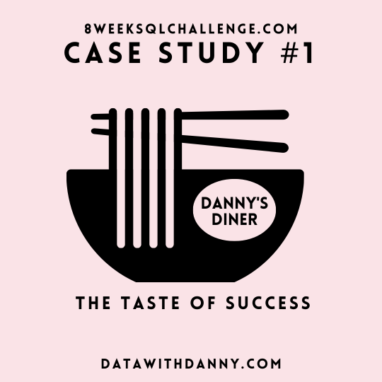

# Case Study #1 - Danny's Diner

# Table of Contents

* [1 Introduction](#Introduction)
* [2 Problem Statement](#Problem-Statement)

* [Schema](https://github.com/Klekzee/SQL-Challenge/blob/c76851a59da9be51918bfb9be36c2634eb02146f/01-DannysDiner/01schema.sql)
* [Queries](https://github.com/Klekzee/SQL-Challenge/blob/c76851a59da9be51918bfb9be36c2634eb02146f/01-DannysDiner/02query.sql)
* [Answers](https://github.com/Klekzee/SQL-Challenge/blob/c76851a59da9be51918bfb9be36c2634eb02146f/01-DannysDiner/03answers.md)

# Introduction

Danny seriously loves Japanese food so in the beginning of 2021, he decides to embark upon a risky venture and opens up a cute little restaurant that sells his 3 favourite foods: sushi, curry and ramen.

Danny’s Diner is in need of your assistance to help the restaurant stay afloat - the restaurant has captured some very basic data from their few months of operation but have no idea how to use their data to help them run the business.

# Problem Statement

Danny wants to use the data to answer a few simple questions about his customers, especially:

* about their visiting patterns
* how much money they’ve spent and
* which menu items are their favourite

Having this deeper connection with his customers will help him deliver a better and more personalised experience for his loyal customers. He plans on using these insights to help him decide whether he should expand the existing customer loyalty program.

# Key Takeaways

From the SQL case study, I reinforced my understanding about:

1. Common Table Expressions (CTEs)
2. Group By Aggregates
3. Window Functions for Ranking
4. Table Joins

I also learned new SQL functions such as `ROW_NUMBER()`, `RANK()`, `DENSE_RANK()`, and `DATE_ADD()`.