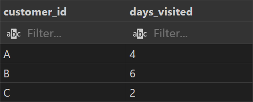
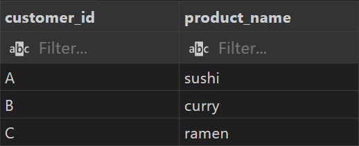
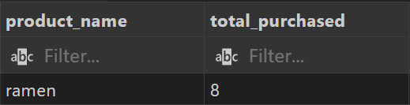
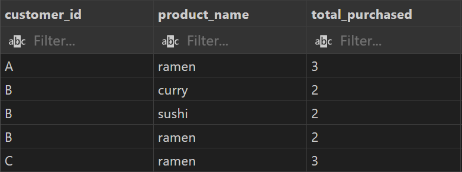
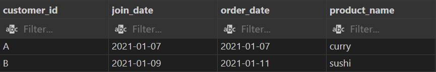
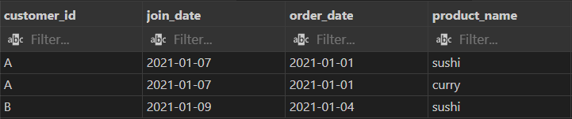
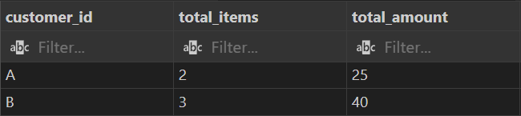
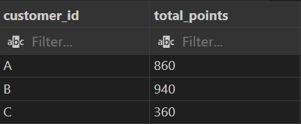
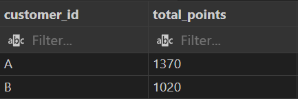

# Case Study #1 - Danny's Diner


<br>

# Table of Contents

* [1 Introduction](#introduction)
    * [1.1 Entity Relationship Diagram](#entity-relationship-diagram)
* [2 Problem Statement](#problem-statement)
* [3 Question and Problems](#question-and-problems)
* [4 Key Takeaways](#key-takeaways)

<br>

* [Schema](https://github.com/Klekzee/SQL-Challenge/blob/c76851a59da9be51918bfb9be36c2634eb02146f/01-DannysDiner/01schema.sql)
* [Queries](https://github.com/Klekzee/SQL-Challenge/blob/c76851a59da9be51918bfb9be36c2634eb02146f/01-DannysDiner/02query.sql)
* [Answers](https://github.com/Klekzee/SQL-Challenge/blob/c76851a59da9be51918bfb9be36c2634eb02146f/01-DannysDiner/03answers.md)

<br>

# Introduction

Danny seriously loves Japanese food so in the beginning of 2021, he decides to embark upon a risky venture and opens up a cute little restaurant that sells his 3 favourite foods: sushi, curry and ramen.

Danny’s Diner is in need of your assistance to help the restaurant stay afloat - the restaurant has captured some very basic data from their few months of operation but have no idea how to use their data to help them run the business.

## Entity Relationship Diagram


<br>

# Problem Statement

Danny wants to use the data to answer a few simple questions about his customers, especially:

* about their visiting patterns
* how much money they’ve spent and
* which menu items are their favourite

Having this deeper connection with his customers will help him deliver a better and more personalised experience for his loyal customers. He plans on using these insights to help him decide whether he should expand the existing customer loyalty program.

<br>

# Question and Problems

Note: All queries are written using MySQL

<br>

**1. What is the total amount each customer spent at the restaurant?**

```sql
SELECT 
    s.customer_id, 
    SUM(m.price) AS total_spent
FROM sales AS s
LEFT JOIN menu AS m
    ON m.product_id = s.product_id
GROUP BY
    s.customer_id;
```

**Answer**


<br>

**2. How many days has each customer visited the restaurant?**

```sql
SELECT 
    customer_id,
    COUNT(DISTINCT(order_date)) AS days_visited
FROM sales
GROUP BY
    customer_id;
```

**Answer**



<br>

**3. What was the first item from the menu purchased by each customer?**

```sql
WITH CTE_first_purchase AS (
    SELECT 
        s.customer_id,
        s.order_date,
        m.product_name,
        ROW_NUMBER() OVER (PARTITION BY s.customer_id ORDER BY s.order_date) AS ranking
    FROM sales AS s
    JOIN menu AS m
        ON m.product_id = s.product_id
)

SELECT 
    customer_id,
    product_name
FROM CTE_first_purchase
WHERE
    ranking = 1;
```

**Answer**



<br>

**4. What is the most purchased item on the menu and how many times was it purchased by all customers?**

```sql
SELECT
    m.product_name,
    COUNT(m.product_id) AS total_purchased
FROM menu AS m
JOIN sales AS s
    ON s.product_id = m.product_id
GROUP BY 
    m.product_name
ORDER BY 
    total_purchased DESC
LIMIT 1;
```

**Answer**



<br>

**5. Which item was the most popular for each customer?**

```sql
WITH CTE_most_popular_item AS (
    SELECT
        s.customer_id,
        m.product_name,
        COUNT(m.product_id) AS total_purchased,
        RANK() OVER (PARTITION BY s.customer_id ORDER BY COUNT(m.product_id) DESC) AS ranking
    FROM sales AS s
    JOIN menu AS m
        ON m.product_id = s.product_id
    GROUP BY
        s.customer_id, m.product_name
)

SELECT
    customer_id,
    product_name,
    total_purchased
FROM CTE_most_popular_item
WHERE
    ranking = 1;
```

**Answer**



<br>

**6. Which item was purchased first by the customer after they became a member?**

```sql
WITH CTE_first_purchace_members AS (
    SELECT
        mem.customer_id,
        mem.join_date,
        s.order_date,
        menu.product_name,
        RANK() OVER (PARTITION BY mem.customer_id ORDER BY s.order_date) AS ranking
    FROM members AS mem
    LEFT JOIN sales AS s
        ON s.customer_id = mem.customer_id
    LEFT JOIN menu
        ON menu.product_id = s.product_id
    WHERE
        s.order_date >= mem.join_date
)

SELECT
    customer_id,
    join_date,
    order_date,
    product_name
FROM CTE_first_purchace_members
WHERE
    ranking = 1;
```

**Answer**



<br>

**7. Which item was purchased just before the customer became a member?**

```sql
WITH CTE_first_purchace_members AS (
    SELECT
        mem.customer_id,
        mem.join_date,
        s.order_date,
        menu.product_name,
        RANK() OVER (PARTITION BY mem.customer_id ORDER BY s.order_date DESC) AS ranking
    FROM members AS mem
    LEFT JOIN sales AS s
        ON s.customer_id = mem.customer_id
    LEFT JOIN menu
        ON menu.product_id = s.product_id
    WHERE
        s.order_date < mem.join_date
)

SELECT
    customer_id,
    join_date,
    order_date,
    product_name
FROM CTE_first_purchace_members
WHERE
    ranking = 1;
```

**Answer**



<br>

**8. What is the total items and amount spent for each member before they became a member?**

```sql
WITH CTE_items_purchased_by_each_customer AS (
    SELECT
        members.customer_id,
        members.join_date,
        sales.order_date,
        sales.product_id,
        menu.product_name,
        menu.price
    FROM members
    JOIN sales
        ON sales.customer_id = members.customer_id
    JOIN menu
        ON menu.product_id = sales.product_id
    WHERE
        sales.order_date < members.join_date
)

SELECT
    customer_id,
    COUNT(*) AS total_items,
    SUM(price) AS total_amount
FROM CTE_items_purchased_by_each_customer
GROUP BY
    customer_id
ORDER BY
    customer_id;
```

**Answer**



<br>\

**9. If each $1 spent equates to 10 points and sushi has a 2x points multiplier - how many points would each customer have?**

```sql
WITH CTE_sushi_points AS (
    SELECT
        sales.customer_id,
        sales.product_id,
        menu.product_name,
        menu.price,
        CASE
            WHEN menu.product_name = "sushi" THEN (menu.price * 10) * 2
            ELSE menu.price * 10
        END AS total_points
    FROM sales
    JOIN menu
        ON menu.product_id = sales.product_id
)

SELECT
    customer_id,
    SUM(total_points) AS total_points
FROM CTE_sushi_points
GROUP BY
    customer_id;
```

**Answer**



<br>

**10. In the first week after a customer joins the program (including their join date) they earn 2x points on all items, not just sushi - how many points do customer A and B have at the end of January?**

```sql
WITH CTE_membership_points AS (
	SELECT 
        members.customer_id,
        members.join_date,
        sales.order_date,
        menu.product_name,
        menu.price,
        CASE
            WHEN sales.order_date >= members.join_date AND sales.order_date < DATE_ADD(members.join_date, INTERVAL 7 DAY) AND menu.product_name = "sushi"
                THEN (menu.price * 10) * 2 * 2
            WHEN sales.order_date >= members.join_date AND sales.order_date < DATE_ADD(members.join_date, INTERVAL 7 DAY)
                THEN (menu.price * 10) * 2
            WHEN product_name = "sushi"
                THEN (menu.price * 10) * 2
            ELSE menu.price * 10
        END AS total_points
    FROM sales
    JOIN members
        ON members.customer_id = sales.customer_id
    JOIN menu
        ON menu.product_id = sales.product_id
    WHERE
        sales.order_date BETWEEN "2021-01-01" AND "2021-01-31"
    ORDER BY
        members.join_date
)

SELECT
    customer_id,
    SUM(total_points) AS total_points
FROM CTE_membership_points
GROUP BY
    customer_id
ORDER BY
    customer_id;
```

**Answer**



<br>

# Key Takeaways

From the SQL case study, I reinforced my understanding about:

1. Common Table Expressions (CTEs)
2. Group By Aggregates
3. Window Functions for Ranking
4. Table Joins

I also learned new SQL functions such as `ROW_NUMBER()`, `RANK()`, `DENSE_RANK()`, and `DATE_ADD()`.