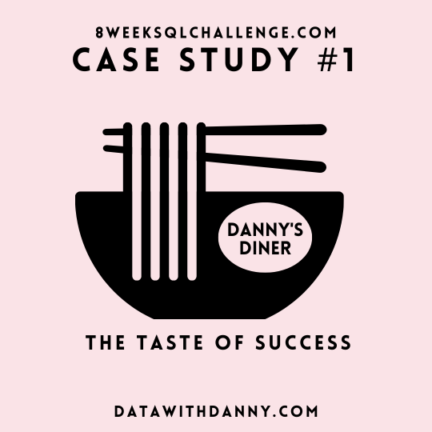
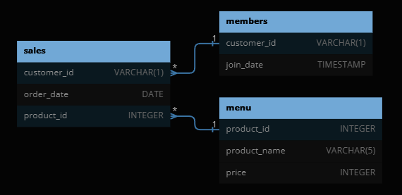

# Case Study #1 - Danny's Diner



<br>

# Table of Contents

* [1 Introduction](#introduction)
    * [1.1 Entity Relationship Diagram](#entity-relationship-diagram)
* [2 Problem Statement](#problem-statement)
* [3 Questions and Answers](#questions-and-Answers)
    * [3.1 Main Questions](#questions-and-Answers)
    * [3.2 Bonus Questions](#bonus-questions)
* [4 Key Takeaways](#key-takeaways)

<br>

* [Schema](01schema.sql)
* [Queries](02query.sql)
* [Answers](03answers.md)

<br>

# Introduction

Danny seriously loves Japanese food so in the beginning of 2021, he decides to embark upon a risky venture and opens up a cute little restaurant that sells his 3 favourite foods: sushi, curry and ramen.

Danny’s Diner is in need of your assistance to help the restaurant stay afloat - the restaurant has captured some very basic data from their few months of operation but have no idea how to use their data to help them run the business.

## Entity Relationship Diagram


<br>

# Problem Statement

Danny wants to use the data to answer a few simple questions about his customers, especially:

* about their visiting patterns
* how much money they’ve spent and
* which menu items are their favourite

Having this deeper connection with his customers will help him deliver a better and more personalised experience for his loyal customers. He plans on using these insights to help him decide whether he should expand the existing customer loyalty program.

<br>

# Questions and Answers

Note: All queries are written using MySQL

<br>

**1. What is the total amount each customer spent at the restaurant?**

```sql
SELECT 
    s.customer_id, 
    SUM(m.price) AS total_spent
FROM sales AS s
LEFT JOIN menu AS m
    ON m.product_id = s.product_id
GROUP BY
    s.customer_id;
```

**Answer**

| **customer_id** | **total_spent** |
|:---------------:|:---------------:|
| A               | 76              |
| B               | 74              |
| C               | 36              |

<br>

**2. How many days has each customer visited the restaurant?**

```sql
SELECT 
    customer_id,
    COUNT(DISTINCT(order_date)) AS days_visited
FROM sales
GROUP BY
    customer_id;
```

**Answer**

| **customer_id** | **days_visited** |
|:---------------:|:----------------:|
| A               | 4                |
| B               | 6                |
| C               | 2                |

<br>

**3. What was the first item from the menu purchased by each customer?**

```sql
WITH CTE_first_purchase AS (
    SELECT 
        s.customer_id,
        s.order_date,
        m.product_name,
        ROW_NUMBER() OVER (PARTITION BY s.customer_id ORDER BY s.order_date) AS ranking
    FROM sales AS s
    JOIN menu AS m
        ON m.product_id = s.product_id
)

SELECT 
    customer_id,
    product_name
FROM CTE_first_purchase
WHERE
    ranking = 1;
```

**Answer**

| **customer_id** | **product_name** |
|:---------------:|:----------------:|
| A               | sushi            |
| B               | curry            |
| C               | ramen            |

<br>

**4. What is the most purchased item on the menu and how many times was it purchased by all customers?**

```sql
SELECT
    m.product_name,
    COUNT(m.product_id) AS total_purchased
FROM menu AS m
JOIN sales AS s
    ON s.product_id = m.product_id
GROUP BY 
    m.product_name
ORDER BY 
    total_purchased DESC
LIMIT 1;
```

**Answer**

| **product_name** | **total_purchased** |
|:----------------:|:-------------------:|
| ramen            | 8                   |

<br>

**5. Which item was the most popular for each customer?**

```sql
WITH CTE_most_popular_item AS (
    SELECT
        s.customer_id,
        m.product_name,
        COUNT(m.product_id) AS total_purchased,
        RANK() OVER (PARTITION BY s.customer_id ORDER BY COUNT(m.product_id) DESC) AS ranking
    FROM sales AS s
    JOIN menu AS m
        ON m.product_id = s.product_id
    GROUP BY
        s.customer_id, m.product_name
)

SELECT
    customer_id,
    product_name,
    total_purchased
FROM CTE_most_popular_item
WHERE
    ranking = 1;
```

**Answer**

| **customer_id** | **product_name** | **total_purchased** |
|:---------------:|:----------------:|:-------------------:|
| A               | ramen            | 3                   |
| B               | curry            | 2                   |
| B               | sushi            | 2                   |
| B               | ramen            | 2                   |
| C               | ramen            | 3                   |

<br>

**6. Which item was purchased first by the customer after they became a member?**

```sql
WITH CTE_first_purchace_members AS (
    SELECT
        mem.customer_id,
        mem.join_date,
        s.order_date,
        menu.product_name,
        RANK() OVER (PARTITION BY mem.customer_id ORDER BY s.order_date) AS ranking
    FROM members AS mem
    LEFT JOIN sales AS s
        ON s.customer_id = mem.customer_id
    LEFT JOIN menu
        ON menu.product_id = s.product_id
    WHERE
        s.order_date >= mem.join_date
)

SELECT
    customer_id,
    join_date,
    order_date,
    product_name
FROM CTE_first_purchace_members
WHERE
    ranking = 1;
```

**Answer**

| **customer_id** | **join_date** | **order_date** | **product_name** |
|:---------------:|:-------------:|:--------------:|:----------------:|
| A               | 1/7/21        | 1/7/21         | curry            |
| B               | 1/9/21        | 1/11/21        | sushi            |

<br>

**7. Which item was purchased just before the customer became a member?**

```sql
WITH CTE_first_purchace_members AS (
    SELECT
        mem.customer_id,
        mem.join_date,
        s.order_date,
        menu.product_name,
        RANK() OVER (PARTITION BY mem.customer_id ORDER BY s.order_date DESC) AS ranking
    FROM members AS mem
    LEFT JOIN sales AS s
        ON s.customer_id = mem.customer_id
    LEFT JOIN menu
        ON menu.product_id = s.product_id
    WHERE
        s.order_date < mem.join_date
)

SELECT
    customer_id,
    join_date,
    order_date,
    product_name
FROM CTE_first_purchace_members
WHERE
    ranking = 1;
```

**Answer**

| **customer_id** | **join_date** | **order_date** | **product_name** |
|:---------------:|:-------------:|:--------------:|:----------------:|
| A               | 1/7/21        | 1/1/21         | sushi            |
| A               | 1/7/21        | 1/1/21         | curry            |
| B               | 1/9/21        | 1/4/21         | sushi            |

<br>

**8. What is the total items and amount spent for each member before they became a member?**

```sql
WITH CTE_items_purchased_by_each_customer AS (
    SELECT
        members.customer_id,
        members.join_date,
        sales.order_date,
        sales.product_id,
        menu.product_name,
        menu.price
    FROM members
    JOIN sales
        ON sales.customer_id = members.customer_id
    JOIN menu
        ON menu.product_id = sales.product_id
    WHERE
        sales.order_date < members.join_date
)

SELECT
    customer_id,
    COUNT(*) AS total_items,
    SUM(price) AS total_amount
FROM CTE_items_purchased_by_each_customer
GROUP BY
    customer_id
ORDER BY
    customer_id;
```

**Answer**

| **customer_id** | **total_items** | **total_amount** |
|:---------------:|:---------------:|:----------------:|
| A               | 2               | 25               |
| B               | 3               | 40               |

<br>

**9. If each $1 spent equates to 10 points and sushi has a 2x points multiplier - how many points would each customer have?**

```sql
WITH CTE_sushi_points AS (
    SELECT
        sales.customer_id,
        sales.product_id,
        menu.product_name,
        menu.price,
        CASE
            WHEN menu.product_name = "sushi" THEN (menu.price * 10) * 2
            ELSE menu.price * 10
        END AS total_points
    FROM sales
    JOIN menu
        ON menu.product_id = sales.product_id
)

SELECT
    customer_id,
    SUM(total_points) AS total_points
FROM CTE_sushi_points
GROUP BY
    customer_id;
```

**Answer**

| **customer_id** | **total_points** |
|:---------------:|:----------------:|
| A               | 860              |
| B               | 940              |
| C               | 360              |

<br>

**10. In the first week after a customer joins the program (including their join date) they earn 2x points on all items, not just sushi - how many points do customer A and B have at the end of January?**

```sql
WITH CTE_membership_points AS (
	SELECT 
        members.customer_id,
        members.join_date,
        sales.order_date,
        menu.product_name,
        menu.price,
        CASE
            WHEN sales.order_date >= members.join_date AND sales.order_date < DATE_ADD(members.join_date, INTERVAL 7 DAY) AND menu.product_name = "sushi"
                THEN (menu.price * 10) * 2 * 2
            WHEN sales.order_date >= members.join_date AND sales.order_date < DATE_ADD(members.join_date, INTERVAL 7 DAY)
                THEN (menu.price * 10) * 2
            WHEN product_name = "sushi"
                THEN (menu.price * 10) * 2
            ELSE menu.price * 10
        END AS total_points
    FROM sales
    JOIN members
        ON members.customer_id = sales.customer_id
    JOIN menu
        ON menu.product_id = sales.product_id
    WHERE
        sales.order_date BETWEEN "2021-01-01" AND "2021-01-31"
    ORDER BY
        members.join_date
)

SELECT
    customer_id,
    SUM(total_points) AS total_points
FROM CTE_membership_points
GROUP BY
    customer_id
ORDER BY
    customer_id;
```

**Answer**

| **customer_id** | **total_points** |
|:---------------:|:----------------:|
| A               | 1370             |
| B               | 1020             |

<br>

# Bonus Questions

**Join All The Things**

Recreate the following table output using the available data:

```sql
CREATE OR REPLACE VIEW joined_table AS (
    SELECT
        sales.customer_id,
        sales.order_date,
        menu.product_name,
        menu.price,
        CASE
            WHEN members.join_date IS NULL THEN "N"
            WHEN members.join_date > sales.order_date THEN "N"
            ELSE "Y"
        END AS member
    FROM sales
    LEFT JOIN members
        ON members.customer_id = sales.customer_id
    JOIN menu
        ON menu.product_id = sales.product_id
    ORDER BY
        sales.customer_id, sales.order_date
);

-- Refresh the Database
SELECT *
FROM joined_table;
```

**Answer**

| **customer_id** | **order_date** | **product_name** | **price** | **member** |
|:---------------:|:--------------:|:----------------:|:---------:|:----------:|
| A               | 1/1/21         | sushi            | 10        | N          |
| A               | 1/1/21         | curry            | 15        | N          |
| A               | 1/7/21         | curry            | 15        | Y          |
| A               | 1/10/21        | ramen            | 12        | Y          |
| A               | 1/11/21        | ramen            | 12        | Y          |
| A               | 1/11/21        | ramen            | 12        | Y          |
| B               | 1/1/21         | curry            | 15        | N          |
| B               | 1/2/21         | curry            | 15        | N          |
| B               | 1/4/21         | sushi            | 10        | N          |
| B               | 1/11/21        | sushi            | 10        | Y          |
| B               | 1/16/21        | ramen            | 12        | Y          |
| B               | 2/1/21         | ramen            | 12        | Y          |
| C               | 1/1/21         | ramen            | 12        | N          |
| C               | 1/1/21         | ramen            | 12        | N          |
| C               | 1/7/21         | ramen            | 12        | N          |

<br>

**Rank All The Things**

Danny also requires further information about the ranking of customer products, but he purposely does not need the ranking for non-member purchases so he expects null ranking values for the records when customers are not yet part of the loyalty program.

```sql
CREATE OR REPLACE VIEW rankings_table AS (
    SELECT
        *,
        CASE 
            WHEN member = 'N' THEN null
            ELSE DENSE_RANK() OVER (PARTITION BY customer_id, member ORDER BY order_date)
        END AS ranking
    FROM joined_table
);

-- Refresh the Database
SELECT *
FROM rankings_table;
```

**Answer**

| **customer_id** | **order_date** | **product_name** | **price** | **member** | **ranking** |
|:---------------:|:--------------:|:----------------:|:---------:|:----------:|:-----------:|
| A               | 1/1/21         | sushi            | 10        | N          |             |
| A               | 1/1/21         | curry            | 15        | N          |             |
| A               | 1/7/21         | curry            | 15        | Y          | 1           |
| A               | 1/10/21        | ramen            | 12        | Y          | 2           |
| A               | 1/11/21        | ramen            | 12        | Y          | 3           |
| A               | 1/11/21        | ramen            | 12        | Y          | 3           |
| B               | 1/1/21         | curry            | 15        | N          |             |
| B               | 1/2/21         | curry            | 15        | N          |             |
| B               | 1/4/21         | sushi            | 10        | N          |             |
| B               | 1/11/21        | sushi            | 10        | Y          | 1           |
| B               | 1/16/21        | ramen            | 12        | Y          | 2           |
| B               | 2/1/21         | ramen            | 12        | Y          | 3           |
| C               | 1/1/21         | ramen            | 12        | N          |             |
| C               | 1/1/21         | ramen            | 12        | N          |             |
| C               | 1/7/21         | ramen            | 12        | N          |             |

<br>

# Key Takeaways

From the SQL case study, I reinforced my understanding about:

1. Common Table Expressions (CTEs)
2. Group By Aggregates
3. Window Functions for Ranking
4. Table Joins

I also learned new SQL functions such as `ROW_NUMBER()`, `RANK()`, `DENSE_RANK()`, and `DATE_ADD()`.