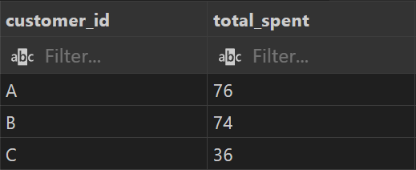
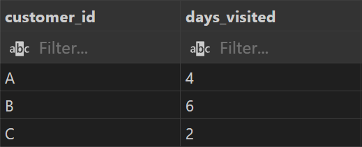
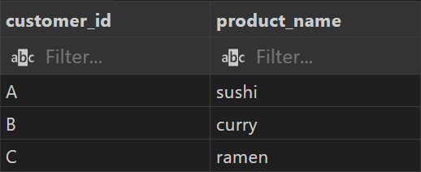
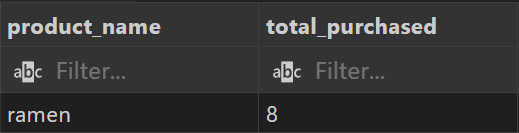

# Case Study #1 - Danny's Diner


<br>

# Table of Contents

* [1 Introduction](#introduction)
    * [1.1 Entity Relationship Diagram](#entity-relationship-diagram)
* [2 Problem Statement](#problem-statement)
* [3 Question and Problems](#question-and-problems)

* [Schema](https://github.com/Klekzee/SQL-Challenge/blob/c76851a59da9be51918bfb9be36c2634eb02146f/01-DannysDiner/01schema.sql)
* [Queries](https://github.com/Klekzee/SQL-Challenge/blob/c76851a59da9be51918bfb9be36c2634eb02146f/01-DannysDiner/02query.sql)
* [Answers](https://github.com/Klekzee/SQL-Challenge/blob/c76851a59da9be51918bfb9be36c2634eb02146f/01-DannysDiner/03answers.md)

<br>

# Introduction

Danny seriously loves Japanese food so in the beginning of 2021, he decides to embark upon a risky venture and opens up a cute little restaurant that sells his 3 favourite foods: sushi, curry and ramen.

Danny’s Diner is in need of your assistance to help the restaurant stay afloat - the restaurant has captured some very basic data from their few months of operation but have no idea how to use their data to help them run the business.

## Entity Relationship Diagram


<br>

# Problem Statement

Danny wants to use the data to answer a few simple questions about his customers, especially:

* about their visiting patterns
* how much money they’ve spent and
* which menu items are their favourite

Having this deeper connection with his customers will help him deliver a better and more personalised experience for his loyal customers. He plans on using these insights to help him decide whether he should expand the existing customer loyalty program.

<br>

# Question and Problems

Note: All queries are written using MySQL

<br>

**1. What is the total amount each customer spent at the restaurant?**

```sql
SELECT 
    s.customer_id, 
    SUM(m.price) AS total_spent
FROM sales AS s
LEFT JOIN menu AS m
    ON m.product_id = s.product_id
GROUP BY
    s.customer_id;
```

**Answer**



<br>

**2. How many days has each customer visited the restaurant?**

```sql
SELECT 
    customer_id,
    COUNT(DISTINCT(order_date)) AS days_visited
FROM sales
GROUP BY
    customer_id;
```

**Answer**



<br>

**3. What was the first item from the menu purchased by each customer?**

```sql
WITH CTE_first_purchase AS (
	SELECT 
        s.customer_id,
        s.order_date,
        m.product_name,
        ROW_NUMBER() OVER (PARTITION BY s.customer_id ORDER BY s.order_date) AS ranking
	FROM sales AS s
    JOIN menu AS m
        ON m.product_id = s.product_id
)

SELECT 
    customer_id,
    product_name
FROM CTE_first_purchase
WHERE
    ranking = 1;
```

**Answer**



<br>

**4. What is the most purchased item on the menu and how many times was it purchased by all customers?**

```sql
SELECT
    m.product_name,
	COUNT(m.product_id) AS total_purchased
FROM menu AS m
JOIN sales AS s
    ON s.product_id = m.product_id
GROUP BY 
    m.product_name
ORDER BY 
    total_purchased DESC
LIMIT 1;
```

**Answer**




# Key Takeaways

From the SQL case study, I reinforced my understanding about:

1. Common Table Expressions (CTEs)
2. Group By Aggregates
3. Window Functions for Ranking
4. Table Joins

I also learned new SQL functions such as `ROW_NUMBER()`, `RANK()`, `DENSE_RANK()`, and `DATE_ADD()`.