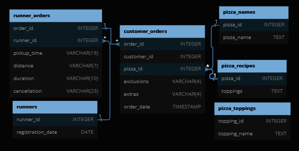

# Case Study #2 - Pizza Runner


<br>

# Table of Contents

* [1 Introduction](#introduction)
    * [1.1 Entity Relationship Diagram](#entity-relationship-diagram)
* [2 Problem Statement](#problem-statement)
* [3 Questions and Answers](#questions-and-answers)
    * [3.1 Data Cleaning](#data-cleaning)
    * [3.2 Pizza Metrics](#a-pizza-metrics)
    * [3.3 Runner and Customer Experience](#b-runner-and-customer-experience)
    * [3.4 Ingredient Optimisation](#c-ingredient-optimisation)
    * [3.5 Pricing and Ratings](#d-pricing-and-ratings)
* [4 Key Takeaways](#key-takeaways)

<br>

* [Schema](01schema.sql)
* [Queries](02query.sql)

<br>

# Introduction

Danny was scrolling through his Instagram feed when something really caught his eye - “80s Retro Styling and Pizza Is The Future!”

Danny was sold on the idea, but he knew that pizza alone was not going to help him get seed funding to expand his new Pizza Empire - so he had one more genius idea to combine with it - he was going to Uberize it - and so Pizza Runner was launched!

Danny started by recruiting “runners” to deliver fresh pizza from Pizza Runner Headquarters (otherwise known as Danny’s house) and also maxed out his credit card to pay freelance developers to build a mobile app to accept orders from customers.

## Entity Relationship Diagram


<br>

# Problem Statement

Because Danny had a few years of experience as a data scientist - he was very aware that data collection was going to be critical for his business’ growth.

He has prepared for us an entity relationship diagram of his database design but requires further assistance to clean his data and apply some basic calculations so he can better direct his runners and optimise Pizza Runner’s operations.

This case study has LOTS of questions - they are broken up by area of focus including:

* Pizza Metrics
* Runner and Customer Experience
* Ingredient Optimisation
* Pricing and Ratings
* Bonus DML Challenges (DML = Data Manipulation Language)

<Br>

# Questions and Answers

**Note:**
* Most queries are written using MySQL.
* I will comment queries that are written on PostgreSQL.

## Data Cleaning

**1. Cleaning the `customer_orders` table**

* Dealing with NULL values

```sql
DROP TABLE IF EXISTS customer_orders_cleaned;
CREATE TABLE customer_orders_cleaned (
    SELECT
        order_id,
        customer_id,
        pizza_id,
        CASE
            WHEN exclusions LIKE 'null' OR exclusions LIKE '' THEN NULL
            ELSE exclusions
        END AS exclusions,
        CASE
            WHEN extras LIKE 'null' OR extras LIKE '' THEN NULL
            ELSE extras
        END AS extras,
        order_time
    FROM customer_orders
);

SELECT * FROM customer_orders_cleaned;
```

**Output**

| **order_id** | **customer_id** | **pizza_id** | **exclusions** | **extras** | **order_time**      |
|:------------:|:---------------:|:------------:|:--------------:|:----------:|:-------------------:|
| 1            | 101             | 1            | `NULL`         | `NULL`     | 2020-01-01 18:05:02 |
| 2            | 101             | 1            | `NULL`         | `NULL`     | 2020-01-01 19:00:52 |
| 3            | 102             | 1            | `NULL`         | `NULL`     | 2020-01-02 23:51:23 |
| 3            | 102             | 2            | `NULL`         | `NULL`     | 2020-01-02 23:51:23 |
| 4            | 103             | 1            | 4              | `NULL`     | 2020-01-04 13:23:46 |
| 4            | 103             | 1            | 4              | `NULL`     | 2020-01-04 13:23:46 |
| 4            | 103             | 2            | 4              | `NULL`     | 2020-01-04 13:23:46 |
| 5            | 104             | 1            | `NULL`         | 1          | 2020-01-08 21:00:29 |
| 6            | 101             | 2            | `NULL`         | `NULL`     | 2020-01-08 21:03:13 |
| 7            | 105             | 2            | `NULL`         | 1          | 2020-01-08 21:20:29 |
| 8            | 102             | 1            | `NULL`         | `NULL`     | 2020-01-09 23:54:33 |
| 9            | 103             | 1            | 4              | 1, 5       | 2020-01-10 11:22:59 |
| 10           | 104             | 1            | `NULL`         | `NULL`     | 2020-01-11 18:34:49 |
| 10           | 104             | 1            | 2, 6           | 1, 4       | 2020-01-11 18:34:49 |

<br>

**2. Cleaning the `runner_orders` table**

* Dealing with NULL values and incorrect data types

```sql
DROP TABLE IF EXISTS runner_orders_cleaned;
CREATE TABLE runner_orders_cleaned (
    SELECT
        order_id,
        runner_id,
        CASE
            WHEN pickup_time LIKE 'null' THEN NULL
            ELSE pickup_time
        END AS pickup_time,
        CASE
            WHEN distance LIKE 'null' THEN NULL
            WHEN distance LIKE '%km' THEN TRIM('km' FROM distance)
            ELSE distance
        END AS distance,
        CASE
            WHEN duration LIKE 'null' THEN NULL
            WHEN duration LIKE '%min%' THEN TRIM('minutes' FROM TRIM('mins' FROM TRIM('minute' FROM duration)))
            ELSE duration
        END AS duration,
        CASE
            WHEN cancellation LIKE 'null' OR cancellation LIKE '' THEN NULL
            ELSE cancellation
        END AS cancellation
    FROM runner_orders
);

ALTER TABLE runner_orders_cleaned
MODIFY COLUMN distance FLOAT;

ALTER TABLE runner_orders_cleaned
MODIFY COLUMN duration INT;

ALTER TABLE runner_orders_cleaned
MODIFY COLUMN pickup_time TIMESTAMP;

DESCRIBE runner_orders_cleaned;

SELECT * FROM runner_orders_cleaned;
```

**Output**

`DESCRIBE TABLE`

| **Field**    | **Type**    | **Null** | **Key** | **Default** | **Extra** |
|:------------:|:-----------:|:--------:|:-------:|:-----------:|:---------:|
| order_id     | int         | YES      |         | `NULL`      |           |
| runner_id    | int         | YES      |         | `NULL`      |           |
| pickup_time  | timestamp   | YES      |         | `NULL`      |           |
| distance     | float       | YES      |         | `NULL`      |           |
| duration     | int         | YES      |         | `NULL`      |           |
| cancellation | varchar(23) | YES      |         | `NULL`      |           |
<br>

`runner_orders_cleaned`

| **order_id** | **runner_id** | **pickup_time**     | **distance** | **duration** | **cancellation**        |
|:------------:|:-------------:|:-------------------:|:------------:|:------------:|:-----------------------:|
| 1            | 1             | 2020-01-01 18:15:34 | 20           | 32           | `NULL`                  |
| 2            | 1             | 2020-01-01 19:10:54 | 20           | 27           | `NULL`                  |
| 3            | 1             | 2020-01-03 00:12:37 | 13.4         | 20           | `NULL`                  |
| 4            | 2             | 2020-01-04 13:53:03 | 23.4         | 40           | `NULL`                  |
| 5            | 3             | 2020-01-08 21:10:57 | 10           | 15           | `NULL`                  |
| 6            | 3             | `NULL`              | `NULL`       | `NULL`       | Restaurant Cancellation |
| 7            | 2             | 2020-01-08 21:30:45 | 25           | 25           | `NULL`                  |
| 8            | 2             | 2020-01-10 00:15:02 | 23.4         | 15           | `NULL`                  |
| 9            | 2             | `NULL`              | `NULL`       | `NULL`       | Customer Cancellation   |
| 10           | 1             | 2020-01-11 18:50:20 | 10           | 10           | `NULL`                  |

<br>

**3. Normalizing the pizza_recipes table**

* We will be using this for the Ingredient Optimization

```sql
DROP TABLE IF EXISTS pizza_recipes_normalized;
CREATE TABLE pizza_recipes_normalized (
    pizza_id INT,
    toppings INT
);

INSERT INTO pizza_recipes_normalized (pizza_id, toppings)
VALUES
    (1, 1),
    (1, 2),
    (1, 3),
    (1, 4),
    (1, 5),
    (1, 6),
    (1, 8),
    (1, 10),
    (2, 4),
    (2, 6),
    (2, 7),
    (2, 9),
    (2, 11),
    (2, 12);

SELECT * FROM pizza_recipes_normalized;
```

**Output**

| **pizza_id** | **toppings** |
|:------------:|:------------:|
| 1            | 1            |
| 1            | 2            |
| 1            | 3            |
| 1            | 4            |
| 1            | 5            |
| 1            | 6            |
| 1            | 8            |
| 1            | 10           |
| 2            | 4            |
| 2            | 6            |
| 2            | 7            |
| 2            | 9            |
| 2            | 11           |
| 2            | 12           |

<br>
<br>

## A. Pizza Metrics

**1. How many pizzas were ordered?**

```sql
SELECT
    COUNT(*) AS total_orders
FROM customer_orders_cleaned;
```

**Answer**

| **total_orders** |
|:----------------:|
|14                |

<br>

**2. How many unique customer orders were made?**

```sql
SELECT
    COUNT(DISTINCT(order_id)) AS total_unique_orders
FROM customer_orders_cleaned;
```

**Answer**

| **total_unique_orders** |
|:-----------------------:|
| 10                      |

<br>

**3. How many successful orders were delivered by each runner?**

```sql
SELECT
    runner_id,
    COUNT(*) AS successful_order
FROM runner_orders_cleaned
WHERE
    cancellation IS NULL
GROUP BY
    runner_id;
```

**Answer**

| **runner_id** | **successful_order** |
|:-------------:|:--------------------:|
| 1             | 4                    |
| 2             | 3                    |
| 3             | 1                    |

<br>

**4. How many of each type of pizza was delivered?**

```sql
SELECT
    p.pizza_name,
    COUNT(*) AS pizza_delivered
FROM runner_orders_cleaned AS ro
JOIN customer_orders_cleaned AS co
    ON co.order_id = ro.order_id
JOIN pizza_names AS p
    ON p.pizza_id = co.pizza_id
WHERE
    ro.cancellation IS NULL
GROUP BY
    p.pizza_name;
```

**Answer**

| **pizza_name** | **pizza_delivered** |
|:--------------:|:-------------------:|
| Meatlovers     | 9                   |
| Vegetarian     | 3                   |

<br>

**5. How many Vegetarian and Meatlovers were ordered by each customer?**

```sql
SELECT
    customer_id,
    SUM(pizza_id = 1) AS meat_lovers,
    SUM(pizza_id = 2) AS vegetarian
FROM customer_orders_cleaned
GROUP BY
    customer_id;
```

**Answer**

| **customer_id** | **meat_lovers** | **vegetarian** |
|:---------------:|:---------------:|:--------------:|
| 101             | 2               | 1              |
| 102             | 2               | 1              |
| 103             | 3               | 1              |
| 104             | 3               | 0              |
| 105             | 0               | 1              |

<br>

**6. What was the maximum number of pizzas delivered in a single order?**

```sql
SELECT
    co.order_id,
    COUNT(co.pizza_id) AS pizza_delivered
FROM runner_orders_cleaned AS ro
JOIN customer_orders_cleaned AS co
    ON co.order_id = ro.order_id
WHERE
    ro.cancellation IS NULL
GROUP BY
    co.order_id
ORDER BY
    pizza_delivered DESC
LIMIT 1;
```

**Answer**

| **order_id** | **pizza_delivered** |
|:------------:|:-------------------:|
| 4            | 3                   |

<br>

**7. For each customer, how many delivered pizzas had at least 1 change and how many had no changes?**

```sql
SELECT
    customer_id,
    SUM(exclusions IS NOT NULL OR extras IS NOT NULL) AS has_change,
    SUM(exclusions IS NULL AND extras IS NULL) AS no_change
FROM customer_orders_cleaned
GROUP BY
    customer_id;
```

**Answer**

| **customer_id** | **has_change** | **no_change** |
|:---------------:|:--------------:|:-------------:|
| 101             | 0              | 3             |
| 102             | 0              | 3             |
| 103             | 4              | 0             |
| 104             | 2              | 1             |
| 105             | 1              | 0             |

<br>

**8. How many pizzas were delivered that had both exclusions and extras?**

```sql
SELECT
    COUNT(*) AS pizza_delivered
FROM runner_orders_cleaned AS ro
JOIN customer_orders_cleaned AS co
    ON co.order_id = ro.order_id
WHERE
    ro.cancellation IS NULL
    AND (co.exclusions IS NOT NULL AND co.extras IS NOT NULL);
```

**Answer**

| **pizza_delivered** |
|:-------------------:|
| 1                   |

<br>

**9. What was the total volume of pizzas ordered for each hour of the day?**

```sql
SELECT 
    HOUR(order_time) AS hour_of_day,
    COUNT(*) AS total_orders
FROM customer_orders_cleaned
GROUP BY
    HOUR(order_time)
ORDER BY
    hour_of_day;
```

**Answer**

| **hour_of_day** | **total_orders** |
|:---------------:|:----------------:|
| 11              | 1                |
| 13              | 3                |
| 18              | 3                |
| 19              | 1                |
| 21              | 3                |
| 23              | 3                |

<br>

**10. What was the volume of orders for each day of the week?**

```sql
SELECT
    DAYNAME(order_time) AS day_of_week,
    COUNT(*) AS total_orders
FROM customer_orders_cleaned
GROUP BY
    DAYNAME(order_time)
ORDER BY
    total_orders DESC;
```

**Answer**

| **day_of_week** | **total_orders** |
|:---------------:|:----------------:|
| Wednesday       | 5                |
| Saturday        | 5                |
| Thursday        | 3                |
| Friday          | 1                |

<br>
<br>

## B. Runner and Customer Experience

**1. How many runners signed up for each 1 week period? (i.e. week starts `2021-01-01`)**

```sql
SELECT
    EXTRACT(WEEK FROM registration_date) AS week,
    COUNT(*) AS runners
FROM runners
GROUP BY
    EXTRACT(WEEK FROM registration_date);
```

**Answer**

| **week** | **runners** |
|:--------:|:-----------:|
| 0        | 1           |
| 1        | 2           |
| 2        | 1           |

<br>

**2. What was the average time in minutes it took for each runner to arrive at the Pizza Runner HQ to pickup the order?**

```sql
SELECT
    ro.runner_id,
    ROUND(AVG(TIMESTAMPDIFF(MINUTE, co.order_time, ro.pickup_time)), 1) AS average_time
FROM runner_orders_cleaned AS ro
JOIN customer_orders_cleaned AS co
    ON co.order_id = ro.order_id
WHERE
    ro.cancellation IS NULL
GROUP BY
    ro.runner_id;
```

**Answer**

| **runner_id** | **average_time** |
|:-------------:|:----------------:|
| 1             | 15.3             |
| 2             | 23.4             |
| 3             | 10.0             |

<br>

**3. Is there any relationship between the number of pizzas and how long the order takes to prepare?**

```sql
WITH CTE_pizzacount_time_relation AS (
    SELECT
        co.order_id,
        COUNT(co.pizza_id) AS number_of_pizza,
        TIMESTAMPDIFF(MINUTE, co.order_time, ro.pickup_time) AS time_diff
    FROM customer_orders_cleaned AS co
    JOIN runner_orders_cleaned AS ro
        ON ro.order_id = co.order_id
    WHERE
        ro.cancellation IS NULL
    GROUP BY
        co.order_id,
        TIMESTAMPDIFF(MINUTE, co.order_time, ro.pickup_time)
)

SELECT
    number_of_pizza,
    AVG(time_diff) AS average_time
FROM CTE_pizzacount_time_relation
GROUP BY
    number_of_pizza;
```

**Answer**

| **number_of_pizza** | **average_time** |
|:-------------------:|:----------------:|
| 1                   | 12.0000          |
| 2                   | 18.0000          |
| 3                   | 29.0000          |

<br>

**4. What was the average distance travelled for each customer?**

```sql
SELECT
    co.customer_id,
    ROUND(AVG(ro.distance), 1) AS average_distance
FROM runner_orders_cleaned AS ro
JOIN customer_orders_cleaned AS co
    ON co.order_id = ro.order_id
WHERE
    ro.cancellation IS NULL
GROUP BY
    co.customer_id;
```

**Answer**

| **customer_id** | **average_distance** |
|:---------------:|:--------------------:|
| 101             | 20                   |
| 102             | 16.7                 |
| 103             | 23.4                 |
| 104             | 10                   |
| 105             | 25                   |

<br>

**5. What was the difference between the longest and shortest delivery times for all orders?**

```sql
SELECT
    MAX(duration) AS longest_delivery_time,
    MIN(duration) AS shortest_delivery_time,
    (MAX(duration) - MIN(duration)) AS time_diff
FROM runner_orders_cleaned
WHERE
    cancellation IS NULL;
```

**Answer**

| **longest_delivery_time** | **shortest_delivery_time** | **time_diff** |
|:-------------------------:|:--------------------------:|:-------------:|
| 40                        | 10                         | 30            |

<br>

**6. What was the average speed for each runner for each delivery and do you notice any trend for these values?**

```sql
-- Note: Speed unit will be km/hr

SELECT
    runner_id,
    ROUND(AVG(distance / (duration / 60)), 2) AS average_speed
FROM runner_orders_cleaned
WHERE
    cancellation IS NULL
GROUP BY
    runner_id;
```

**Answer**

| **runner_id** | **average_speed** |
|:-------------:|:-----------------:|
| 1             | 45.54             |
| 2             | 62.9              |
| 3             | 40                |

<br>

**7. What is the successful delivery percentage for each runner?**

```sql
WITH CTE_successful_deliveries AS (
    SELECT
        runner_id,
        COUNT(*) AS successful_orders
    FROM runner_orders_cleaned
    WHERE
        cancellation IS NULL
    GROUP BY
        runner_id
),

CTE_total_deliveries AS (
    SELECT
        runner_id,
        COUNT(*) AS total_orders
    FROM runner_orders_cleaned
    GROUP BY
        runner_id
)

SELECT
    sd.runner_id,
    ROUND((successful_orders / total_orders) * 100, 1) AS percentage
FROM CTE_successful_deliveries AS sd
JOIN CTE_total_deliveries AS td
    ON td.runner_id = sd.runner_id;
```

**Answer**

| **runner_id** | **percentage** |
|:-------------:|:--------------:|
| 1             | 100.0          |
| 2             | 75.0           |
| 3             | 50.0           |

<br>
<br>

## C. Ingredient Optimisation

**1. What are the standard ingredients for each pizza?**

```sql
WITH CTE_standard_ingd AS (
    SELECT
        pn.pizza_id,
        pn.pizza_name,
        pr.toppings,
        pt.topping_name
    FROM pizza_names AS pn
    JOIN pizza_recipes_normalized AS pr
        ON pr.pizza_id = pn.pizza_id
    JOIN pizza_toppings AS pt
        ON pt.topping_id = pr.toppings
    ORDER BY
        pn.pizza_id
)

SELECT
    pizza_name,
    GROUP_CONCAT(topping_name SEPARATOR ', ') AS standard_ingredients
FROM CTE_standard_ingd
GROUP BY
    pizza_name;
```

**Answer**

| **pizza_name** | **standard_ingredients**                                              |
|:--------------:|:---------------------------------------------------------------------:|
| Meatlovers     | Bacon, BBQ Sauce, Beef, Cheese, Chicken, Mushrooms, Pepperoni, Salami |
| Vegetarian     | Cheese, Mushrooms, Onions, Peppers, Tomatoes, Tomato Sauce            |

<br>

**2. What was the most commonly added extra?**

```sql
WITH CTE_common_extra AS (
    SELECT
        SUBSTR(extras, 1, 1) AS extra_id
    FROM customer_orders_cleaned
    WHERE
        extras IS NOT NULL
    UNION ALL
    SELECT
        SUBSTRING_INDEX(extras, ",", -1) AS extra_id
    FROM customer_orders_cleaned
    WHERE
        LENGTH(extras) > 1
)

SELECT
    ce.extra_id AS topping_id,
    COUNT(ce.extra_id) AS occurence,
    pt.topping_name
FROM CTE_common_extra AS ce
JOIN pizza_toppings AS pt
    ON pt.topping_id = ce.extra_id
GROUP BY
    ce.extra_id, pt.topping_name
ORDER BY
    occurence DESC
LIMIT 1; -- Remove the limit if you want to see the full list.
```

**Answer**

| **topping_id** | **occurence** | **topping_name** |
|:--------------:|:-------------:|:----------------:|
| 1              | 4             | Bacon            |

<br>

**3. What was the most common exclusion?**

```sql
WITH CTE_common_exclusion AS (
    SELECT
        SUBSTR(exclusions, 1, 1) AS exclusion_id
    FROM customer_orders_cleaned
    WHERE
        exclusions IS NOT NULL
    UNION ALL
    SELECT
        SUBSTRING_INDEX(exclusions, ",", -1) AS exclusion_id
    FROM customer_orders_cleaned
    WHERE
        LENGTH(exclusions) > 1
)

SELECT
    ce.exclusion_id AS topping_id,
    COUNT(ce.exclusion_id) AS occurence,
    pt.topping_name
FROM CTE_common_exclusion AS ce
JOIN pizza_toppings AS pt
    ON pt.topping_id = ce.exclusion_id
GROUP BY
    ce.exclusion_id, pt.topping_name
ORDER BY
    occurence DESC
LIMIT 1; -- Remove the limit if you want to see the full list.
```

**Answer**

| **topping_id** | **occurence** | **topping_name** |
|:--------------:|:-------------:|:----------------:|
| 4              | 4             | Cheese           |

<br>

**4. Generate an order item for each record in the customers_orders table in the format of one of the following:**

* **Meat Lovers**
* **Meat Lovers - Exclude Beef**
* **Meat Lovers - Extra Bacon**
* **Meat Lovers - Exclude Cheese, Bacon - Extra Mushroom, Peppers**

```sql
-- Comment:
-- This is a total mess, but it automatically returns the topping name whatever exclusion_id or extras_id are inputed. Basically it becomes automated.
-- It can be solve without using CTE but it will become even messier.
-- I am also assuming that you can only have max 2 exclusions and extras.
-- Do let me know if there is a better way to solve this.

WITH CTE_order_item AS (
    SELECT
        *,
        CASE
            WHEN pizza_id = 1 THEN 'Meat Lovers'
            ELSE 'Veggie Lovers'
        END AS order_item_name,
        CASE
            WHEN LENGTH(exclusions) > 1
            THEN CONCAT('Exclude ', CONCAT_WS(', ', (
                SELECT topping_name
                FROM pizza_toppings
                WHERE topping_id = SUBSTR(exclusions, 1, 1)), (
                    SELECT topping_name
                    FROM pizza_toppings
                    WHERE topping_id = SUBSTR(exclusions, 4, 1))))
            ELSE CONCAT('Exclude ', (
                SELECT topping_name
                FROM pizza_toppings
                WHERE topping_id = SUBSTR(exclusions, 1, 1)))
        END AS order_item_exclusions,
        CASE
            WHEN LENGTH(extras) > 1
            THEN CONCAT('Extra ', CONCAT_WS(', ', (
                SELECT topping_name
                FROM pizza_toppings
                WHERE topping_id = SUBSTR(extras, 1, 1)), (
                    SELECT topping_name
                    FROM pizza_toppings
                    WHERE topping_id = SUBSTR(extras, 4, 1))))
            ELSE CONCAT('Extra ', (
                SELECT topping_name
                FROM pizza_toppings
                WHERE topping_id = SUBSTR(extras, 1, 1)))
        END AS order_item_extras
    FROM customer_orders_cleaned
)

SELECT
    order_id,
    customer_id,
    pizza_id,
    exclusions,
    extras,
    order_time,
    CONCAT_WS(' - ', order_item_name, order_item_exclusions, order_item_extras) AS order_item
FROM CTE_order_item;
```

**Answer**

| **order_id** | **customer_id** | **pizza_id** | **exclusions** | **extras** | **order_time**      | **order_item**                                                   |
|:------------:|:---------------:|:------------:|:--------------:|:----------:|:-------------------:|:----------------------------------------------------------------:|
| 1            | 101             | 1            | `NULL`         | `NULL`     | 2020-01-01 18:05:02 | Meat Lovers                                                      |
| 2            | 101             | 1            | `NULL`         | `NULL`     | 2020-01-01 19:00:52 | Meat Lovers                                                      |
| 3            | 102             | 1            | `NULL`         | `NULL`     | 2020-01-02 23:51:23 | Meat Lovers                                                      |
| 3            | 102             | 2            | `NULL`         | `NULL`     | 2020-01-02 23:51:23 | Veggie Lovers                                                    |
| 4            | 103             | 1            | 4              | `NULL`     | 2020-01-04 13:23:46 | Meat Lovers - Exclude Cheese                                     |
| 4            | 103             | 1            | 4              | `NULL`     | 2020-01-04 13:23:46 | Meat Lovers - Exclude Cheese                                     |
| 4            | 103             | 2            | 4              | `NULL`     | 2020-01-04 13:23:46 | Veggie Lovers - Exclude Cheese                                   |
| 5            | 104             | 1            | `NULL`         | 1          | 2020-01-08 21:00:29 | Meat Lovers - Extra Bacon                                        |
| 6            | 101             | 2            | `NULL`         | `NULL`     | 2020-01-08 21:03:13 | Veggie Lovers                                                    |
| 7            | 105             | 2            | `NULL`         | 1          | 2020-01-08 21:20:29 | Veggie Lovers - Extra Bacon                                      |
| 8            | 102             | 1            | `NULL`         | `NULL`     | 2020-01-09 23:54:33 | Meat Lovers                                                      |
| 9            | 103             | 1            | 4              | 1, 5       | 2020-01-10 11:22:59 | Meat Lovers - Exclude Cheese - Extra Bacon, Chicken              |
| 10           | 104             | 1            | `NULL`         |            | 2020-01-11 18:34:49 | Meat Lovers                                                      |
| 10           | 104             | 1            | 2, 6           | 1, 4       | 2020-01-11 18:34:49 | Meat Lovers - Exclude BBQ Sauce, Mushrooms - Extra Bacon, Cheese |

<br>

**5. Generate an alphabetically ordered comma separated ingredient list for each pizza order from the customer_orders table and add a 2x in front of any relevant ingredients**

* **For example: "Meat Lovers: 2xBacon, Beef, ... , Salami"**

```sql
-- WIP
```

**Answer**

`WIP`

<br>

**6. What is the total quantity of each ingredient used in all delivered pizzas sorted by most frequent first?**

```sql
-- WIP
```

**Answer**

`WIP`

<br>
<br>

## D. Pricing and Ratings


# Key Takeaways

From the SQL case study, I reinforced my understanding about:

1. Common Table Expressions (CTEs)
2. Group By Aggregates
3. Window Functions for Ranking
4. Table Joins

I also learned new SQL functions such as `ROW_NUMBER()`, `RANK()`, `DENSE_RANK()`, and `DATE_ADD()`.