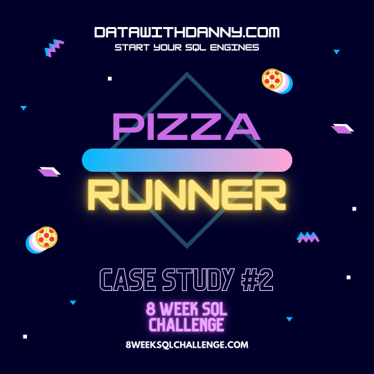

# Case Study #2 - Pizza Runner



<br>

# Table of Contents

* [1 Introduction](#introduction)
    * [1.1 Entity Relationship Diagram](#entity-relationship-diagram)
* [2 Problem Statement](#problem-statement)


* [Schema]()
* [Queries]()
* [Answers]()

<br>

# Introduction

Danny was scrolling through his Instagram feed when something really caught his eye - “80s Retro Styling and Pizza Is The Future!”

Danny was sold on the idea, but he knew that pizza alone was not going to help him get seed funding to expand his new Pizza Empire - so he had one more genius idea to combine with it - he was going to Uberize it - and so Pizza Runner was launched!

Danny started by recruiting “runners” to deliver fresh pizza from Pizza Runner Headquarters (otherwise known as Danny’s house) and also maxed out his credit card to pay freelance developers to build a mobile app to accept orders from customers.

## Entity Relationship Diagram


<br>

# Problem Statement

Because Danny had a few years of experience as a data scientist - he was very aware that data collection was going to be critical for his business’ growth.

He has prepared for us an entity relationship diagram of his database design but requires further assistance to clean his data and apply some basic calculations so he can better direct his runners and optimise Pizza Runner’s operations.

This case study has LOTS of questions - they are broken up by area of focus including:

* Pizza Metrics
* Runner and Customer Experience
* Ingredient Optimisation
* Pricing and Ratings
* Bonus DML Challenges (DML = Data Manipulation Language)

<Br>

# Question and Problems

**Note:**
* Most queries are written using MySQL.
* I will comment queries that are written on PostgreSQL.

## A. Pizza Metrics

**1. How many pizzas were ordered?**

```sql
SELECT
    COUNT(*) AS total_orders
FROM customer_orders_cleaned;
```

**Answer**

| **total_orders** |
|:----------------:|
|14                |


# Key Takeaways

From the SQL case study, I reinforced my understanding about:

1. Common Table Expressions (CTEs)
2. Group By Aggregates
3. Window Functions for Ranking
4. Table Joins

I also learned new SQL functions such as `ROW_NUMBER()`, `RANK()`, `DENSE_RANK()`, and `DATE_ADD()`.